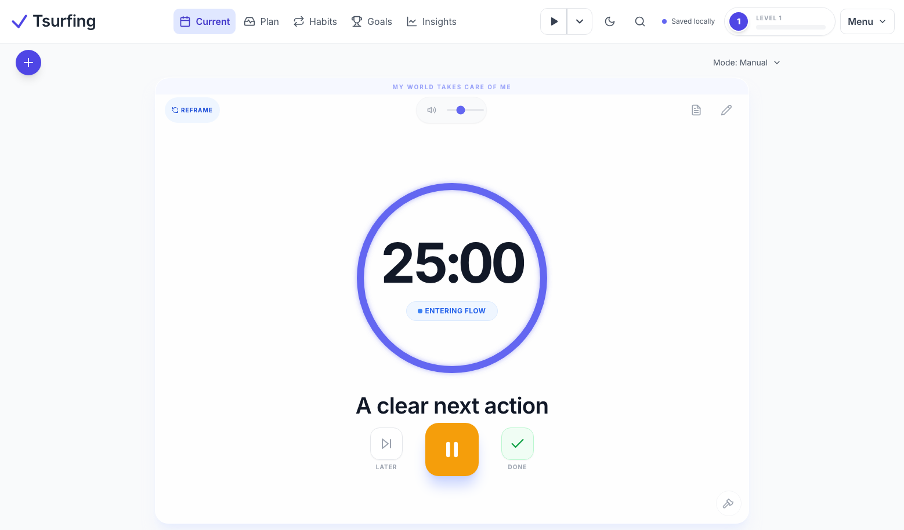
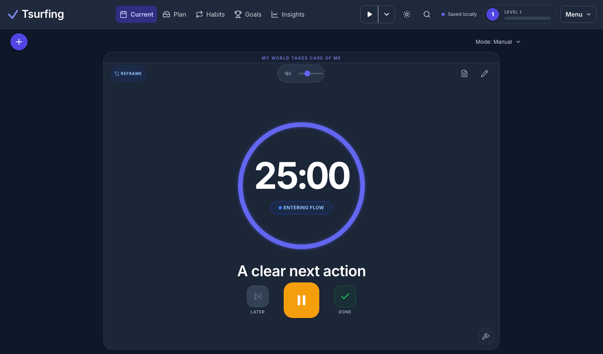
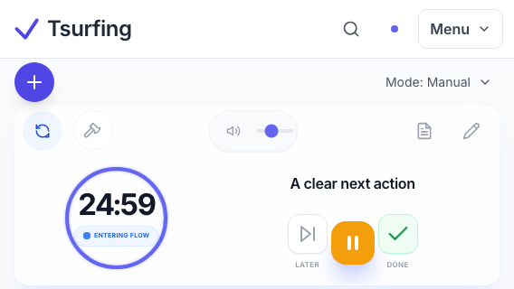
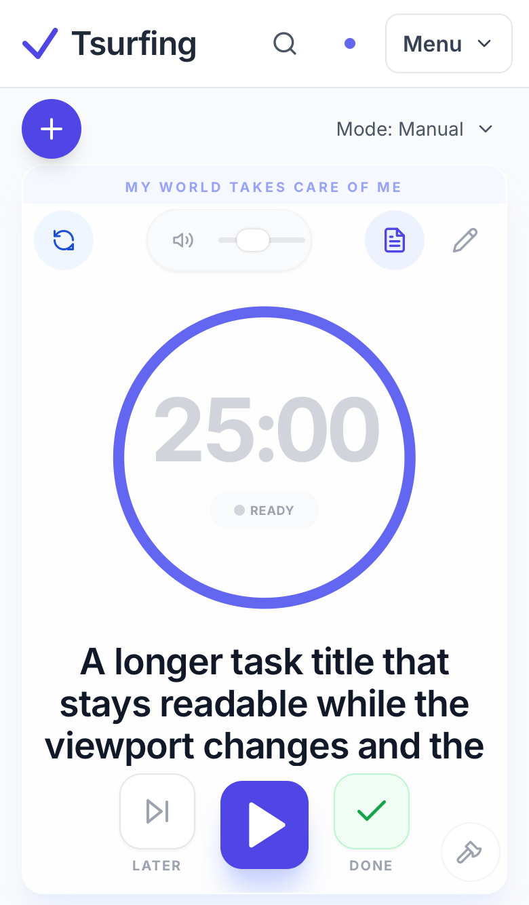
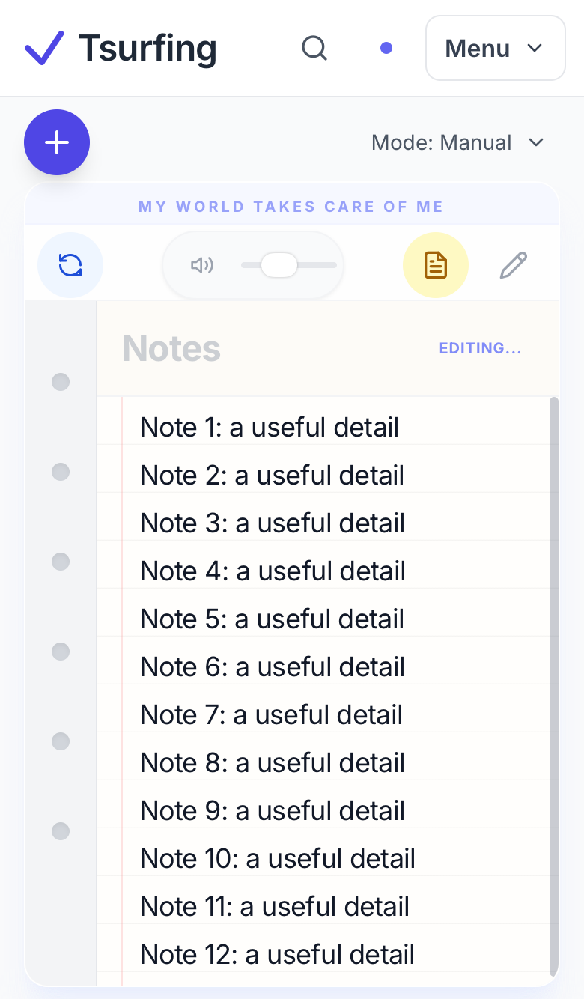
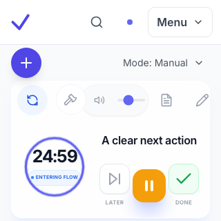

# Current viewport and music controls

Current now fits the available browser height. The timer, title and actions scale with the focus area; short screens use two columns. Notes scroll inside their panel, long titles remain accessible through internal scrolling, and Add sits beside the mode row. Other pages retain document scrolling.

Music uses filled 20px play/pause symbols, a heavier chevron and a straight 2px divider, with stronger contrast in dark and playing states.

Web presentation only: event handlers, focus-session state, audio ownership, storage, sync, backend, native Swift/Compose and hosting configuration are unchanged. Based on staging cd87115f39290825d24dfb2e3d9a2257a8e7d8e3.

## Verification

- PASS: TypeScript (`npm run lint`).
- PASS: production web, Mini App and server build, client secret scan and production artifact/test-backdoor checks (`npm run build`).
- PASS: all 38 navigation, Current and web-critical browser tests in Chromium and WebKit; no retries/skips/failures.
- PASS: final 8 Current tests repeated after settling screenshot animations; 16 viewport sizes in both themes, running-session identity preserved, notes typing/focus, empty and break states, Plan normal scrolling.
- Synthetic fixture screenshots only; no owner data included.
- Physical phones, virtual-keyboard/safe-area behavior and audible radio playback are not measured by these browser checks. Wider hosted sync CI is separate from this UI acceptance.

The deployment revision and live checks are recorded in the associated GitHub pull request after publication.

